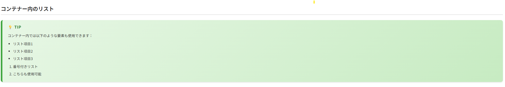

# remark-directive コンテナーサンプル

このディレクトリには、remark-directive を使用したコンテナースタイルのレンダリング結果が含まれています。

## ファイル

- `sample.html` - レンダリングされたHTMLファイル
- `theme.css` - コンテナー用のスタイルシート
- `images/` - サンプル画像ディレクトリ
  - `basic-containers.png` - 基本的なコンテナの表示例
  - `codeblock-in-containers.png` - コンテナ内のコードブロック例
  - `list-in-containers.png` - コンテナ内のリスト表示例
  - `nested-containers.png` - ネストされたコンテナの例

## コンテナーの種類と色分け

各コンテナーは視覚的に区別しやすいよう、以下の色分けがされています：

- **📝 NOTE（注記）** - 青色系（#e6f2ff → #cce7ff）
- **💡 TIP（ヒント）** - 緑色系（#e6f7e6 → #c3ebc3）
- **⚠️ WARNING（警告）** - 黄色系（#fff9e6 → #ffeecc）
- **🚨 DANGER（危険）** - 赤色系（#ffe6e6 → #ffcccc）
- **ℹ️ INFO（情報）** - 水色系（#e6f5f7 → #c5e9ed）
- **🚧 CAUTION（注意）** - オレンジ系（#fff4e6 → #ffe5cc）
- **‼️ IMPORTANT（重要）** - ピンク系（#fdf2f8 → #f9dded）

## 技術スタック

このサンプルは以下の技術を使用しています：

- **remark-parse** - Markdown を mdast（Markdown AST）に変換
- **remark-directive** - `:::` 記法のディレクティブをサポート
- **remark-rehype** - mdast を hast（HTML AST）に変換
- **rehype-stringify** - hast を HTML 文字列に変換
- **Vivliostyle** - 美しい印刷用スタイルを提供

## レンダリング結果の確認

`sample.html` をブラウザで開くと、すべてのコンテナースタイルが適用された状態で確認できます。

スクリーンショットを撮影する際は、各コンテナーがはっきりと識別できるように撮影してください。

## サンプル画像

### 基本的なコンテナ

各種コンテナ（note、warning、tip、danger、info、caution、important）の基本的な表示例です。それぞれ独自の色とアイコンで視覚的に区別されています。

### コンテナ内のコードブロック

コンテナ内にコードブロックを配置した例です。シンタックスハイライトが適用され、コンテナのスタイルと調和して表示されます。

### コンテナ内のリスト

コンテナ内に番号付きリストや箇条書きリストを配置した例です。リストのインデントとスタイルが適切に保持されます。

### ネストされたコンテナ

コンテナを入れ子にした複雑な構造の例です。内側のコンテナは外側のコンテナのスタイルを継承しながら、独自のスタイルも適用されます。